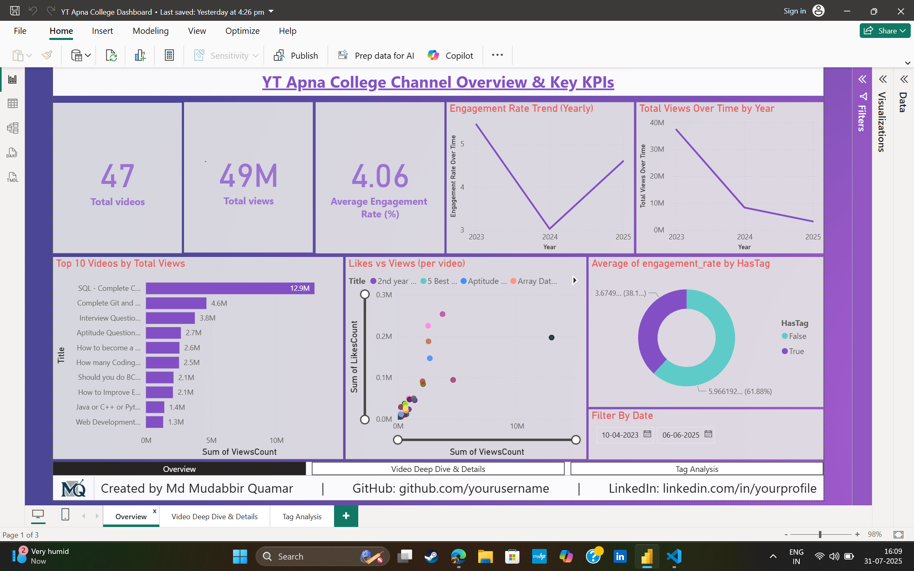
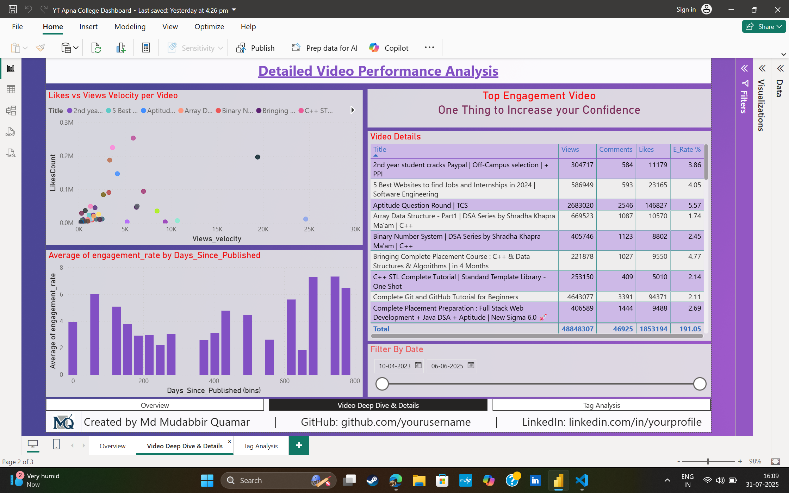
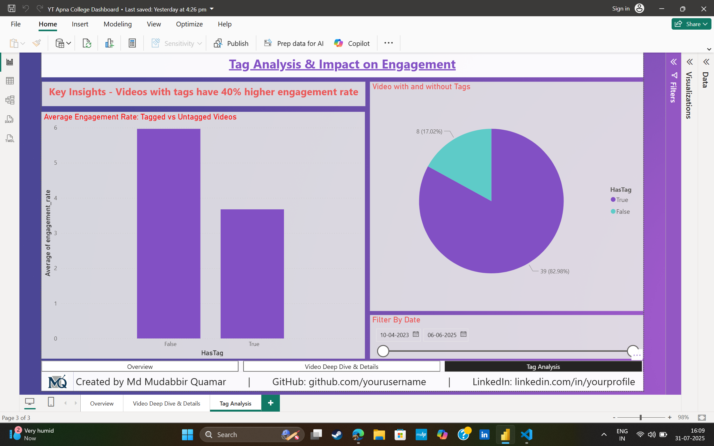

# 📊 YouTube Channel Analytics: Apna College (ETL + Power BI Dashboard)

End-to-end data engineering and analytics project built to analyze the **Apna College YouTube channel**  
using Python, PostgreSQL, and Power BI.

🚀 Goal: Build an automated ETL pipeline to extract data from YouTube, transform it, load into PostgreSQL, and create an interactive Power BI dashboard to analyze video performance & engagement.

---

📌 Project Overview
This project fetches real-time video data from the Apna College YouTube channel, transforms and analyzes it (views, engagement rates, tags), loads into a PostgreSQL database,
and presents rich visual insights in Power BI.

It simulates a real-world data engineering pipeline + reporting solution.


##  **Features & Insights**
- Fetch real-time video metadata & statistics
- Clean & normalize nested JSON to structured tables
- Calculate:
    - Engagement rate: (likes + comments) / views
    - Video longevity & views velocity
    - Tag analysis: do tags improve engagement?
- Power BI dashboard:
    - Total views & videos
    - Top videos & tags
    - Engagement over time
    - Scatter plot: views vs. engagement
    - Tag impact charts

---

## 🛠 **Tools & Technologies Used**
- Python (pandas, requests, sqlalchemy, python-dotenv)
- PostgreSQL
- Power BI
- Git & GitHub

---
```markdown
## 📦 Project Structure

```YouTube-Channel-Analytics/
├── Scripts/                        # Python ETL scripts
│   ├── fetch_data.py               # Fetch data from YouTube API
│   ├── transform_data.py           # Clean & transform data
│   ├── load_data_to_db.py          # Load data into PostgreSQL
│   └── load_data_to_csv.py         # Export data into CSV files
├── db/
│   └── connection.py
├── images/
│   └── page1.png
|   └── page2.png
|   └── page3.png             
├── Data/
│   ├── Raw_data/                   # Raw API data
│   │   └── video_data.json
│   └── Processed_data/             # Cleaned & transformed CSVs
│       ├── clean_data.csv
│       ├── structured_data.csv
│       ├── tag_analyzed_data.csv
│       └── transformed_data.csv
├── Dashboard/
│   ├── YT-Apna-College-Dashboard.pbix    # Power BI dashboard file
│   └── YT-Apna-College-Dashboard.pdf     # Exported PDF
├── requirements.txt                 # Python dependencies
├── README.md
└── .gitignore


---

## 🔄 **ETL Pipeline Overview**
✅ **Extract:**  
- Fetch video data from YouTube API

✅ **Transform:**  
- Clean, normalize, and enrich data:
  - Parse nested JSON
  - Convert data types
  - Calculate:
    - Engagement rate
    - Views velocity
    - Days since published
  - Analyze tags

✅ **Load:**  
- Load clean & transformed data into PostgreSQL database
- Separate tables: raw, cleaned, transformed, tag analysis

---

## 📊 **Power BI Dashboard**
Built on top of PostgreSQL data:
- KPIs: Total videos, total views, average engagement rate
- Top 10 videos by views
- Views & engagement trends over time
- Likes vs views scatter plot
- Tag analysis: engagement rate with vs without tags
- Detailed video table

> 🧩 **Pages:**  
> 1️⃣ Overview & KPIs  
> 2️⃣ Video Deep Dive  
> 3️⃣ Tag Analysis & Impact

---

## ⚙ **How to Run Locally**

1️⃣ Clone this repo:

    git clone https://github.com/MudabbirQuamar/YouTube-Channel-Analytics.git
    cd YouTube-Channel-Analytics

2️⃣ Install dependencies:

    python -m venv venv
    venv\Scripts\activate  # Windows
    pip install -r requirements.txt

3️⃣ Add your API key & DB config to .env file:

    YOUTUBE_API_KEY=your_key
    CHANNEL_ID=your_channel_id
    DB_USER=your_db_user
    DB_PASSWORD=your_password
    DB_HOST=localhost
    DB_PORT=5432
    DB_NAME=your_db_name

4️⃣ Run ETL pipeline:
    
    python Scripts/fetch_data.py
    python Scripts/transform_data.py
    python Scripts/load_data_to_db.py

5️⃣ Open Power BI → connect to PostgreSQL → refresh dashboard

## 📊 Dashboard Preview






---

## ✏ Author

Built with ❤️ by **Md Mudabbir Quamar**
If you like this project:
Give it a ⭐ on GitHub and connect on linkedin

- 🔗 [GitHub](https://github.com/MudabbirQuamar)
- 🔗 [LinkedIn](https://www.linkedin.com/in/mudabbirquamar)
